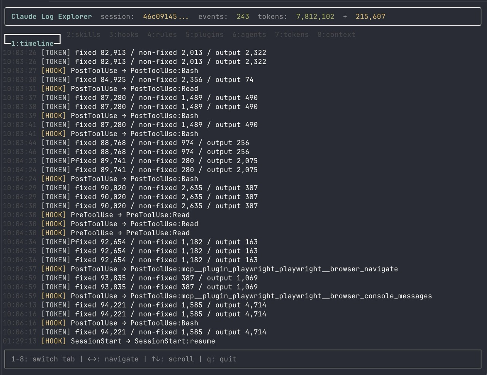
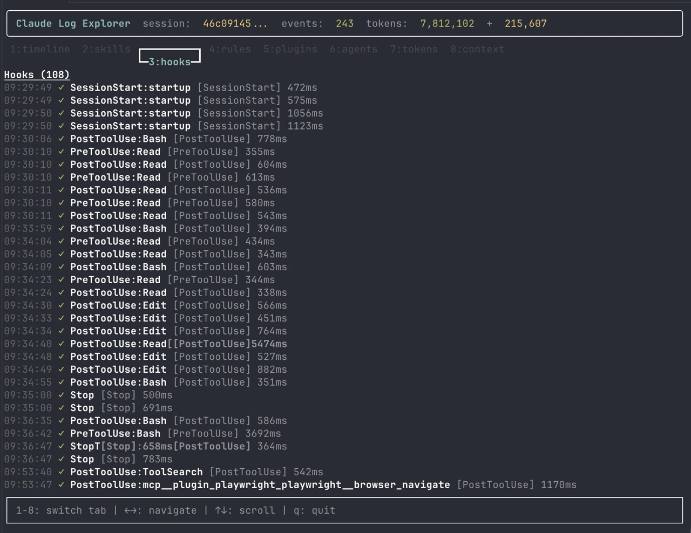
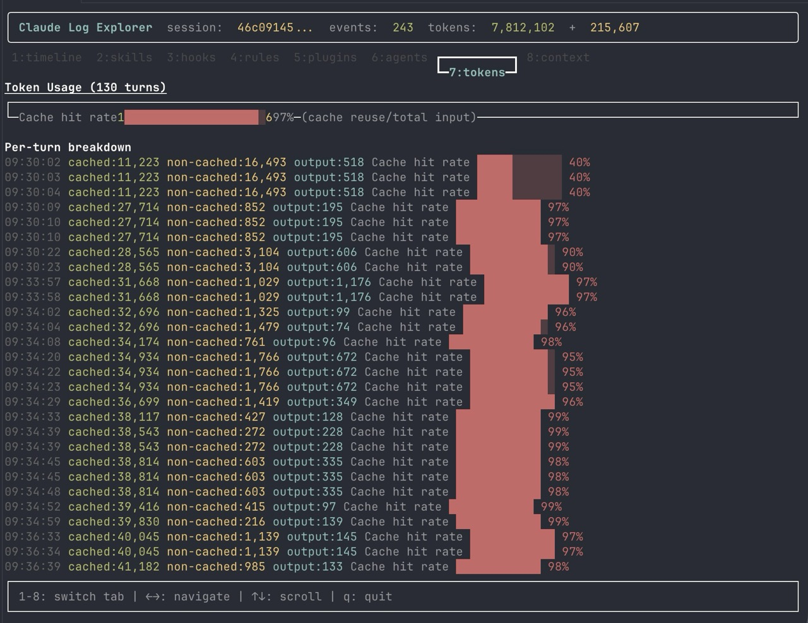
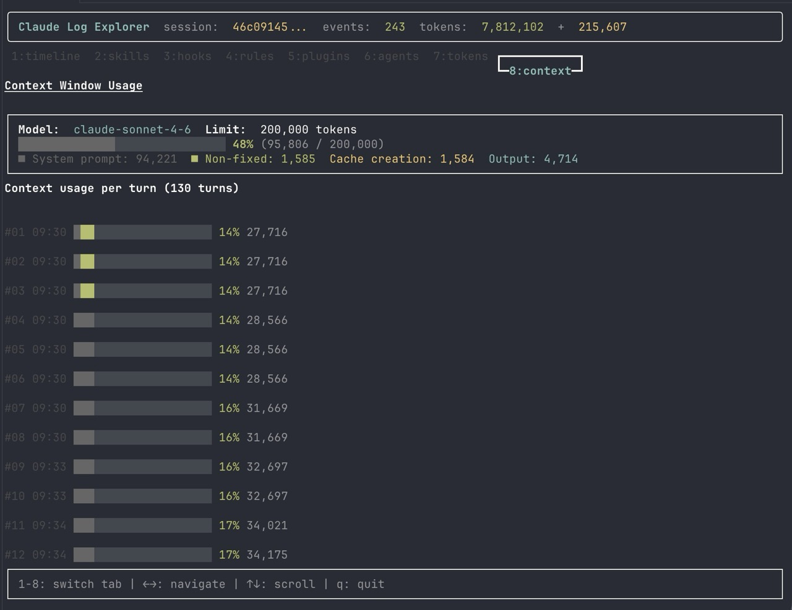

# clogex

[](https://www.npmjs.com/package/@bdmakers/claude-log-ex)
[](https://github.com/bd-makers/claude-log-ex/releases)
[](https://www.npmjs.com/package/@bdmakers/claude-log-ex)
[](https://www.typescriptlang.org)
[](https://bun.sh)

TUI for exploring [Claude Code](https://claude.ai/code) session logs.

Visualizes token usage, context window, skills, hooks, rules, plugins, agents, and more — directly from your Claude Code JSONL session files. Live-tails the session as it runs.

## Install

### Homebrew (macOS, recommended)

```sh
brew tap bd-makers/claude-log-ex https://github.com/bd-makers/claude-log-ex
brew install clogex
```

### npm

```sh
npm install -g clogex
```

### Bun

```sh
bun add -g clogex
```

## Usage

```sh
# auto-detect latest session in current project
clogex

# specify a session file directly
clogex ~/.claude/projects/<project-hash>/<session>.jsonl

# show version
clogex --version

# Korean UI
clogex --ko

# English UI (default)
clogex --en
```

## Screenshots

| Timeline | Hooks |
|----------|-------|
|  |  |

| Tokens | Context |
|--------|---------|
|  |  |

## Tabs

| Key | Tab | Description |
|-----|-----|-------------|
| `1` | timeline | All events in chronological order |
| `2` | skills | Skill invocations |
| `3` | hooks | Hook executions |
| `4` | rules | Active rules loaded |
| `5` | plugins | Loaded MCP plugins |
| `6` | agents | Subagent dispatches |
| `7` | tokens | Token usage per turn with cache hit rate |
| `8` | context | Context window usage visualization |

## Keyboard shortcuts

| Key | Action |
|-----|--------|
| `1`–`8` | Switch tab |
| `←` / `→` | Navigate tabs |
| `↑` / `↓` | Scroll |
| Mouse wheel | Scroll |
| `q` | Quit |

## Build from source

Requires [Bun](https://bun.sh).

```sh
git clone https://github.com/bd-makers/claude-log-ex.git
cd claude-log-ex
bun install

# install to ~/.local/bin/clogex
bun run build

# build dist/cli.js for npm publishing
bun run build:npm
```

## License

MIT
